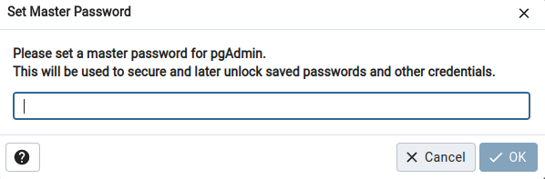
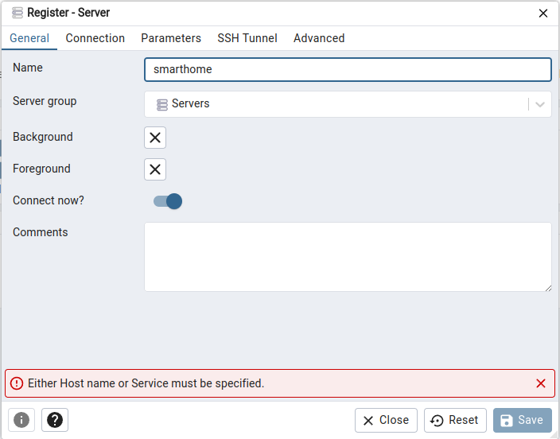
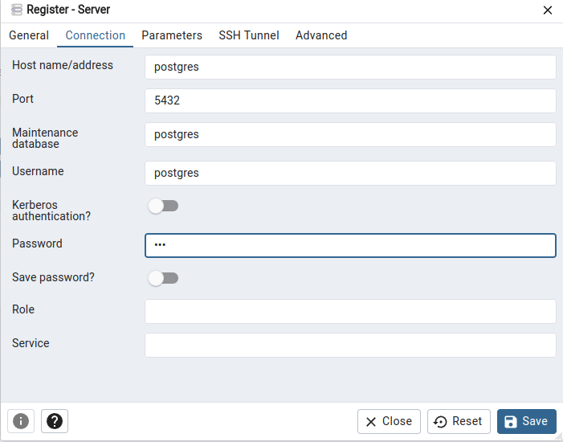
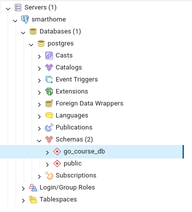

# Домашнее задание №11: Запросы в Postgres
Цель домашнего задания - освоиться c postgres

### подготовка
Перед началом работы необходимо установить [docker, docker-compose](https://docs.docker.com/compose/install/).

### запуск
```shell
docker-compose up
```
Docker запустит два инстанса: `админку` и `postgres`.  
В postgres уже будет предустановленная БД с данными по "умному дому", содержащая следующие таблицы:
* sensors - таблица содержит информацию о датчиках;
* users - таблица содержит информацию о пользователях;
* events - таблица содержит информацию о событиях с датчиков;
* sensors_users - таблица представляет связь многие ко многим.

### как работать с админкой?
1. ждём когда `postgres` загрузит таблицы;  
   `postgres_1  | 2024-05-06 11:15:14.350 UTC [1] LOG:  database system is ready to accept connections`
2. после запуска контейнеров открываем браузер и переходим на `localhost:5050`;
3. вводим пароль `123`;  
   
4. далее нужно подключиться к БД, для этого слева правой кнопкой мыши кликаем на servers -> register -> Servers...;
5. вводим имя `smarthome`;  
   
6. в `connections` вводим хост `postgres` и пароль `123`, сохраняем;
   
7. В левом углу должен появиться слоник и в схемах `go_course_db`;  
   
8. кликаем правой кнопкой мыши на `go_course_db` выбираем `Query Tool` и в появившимся окне вводим:
```sql
select * from go_course_db.users
```
   

### задачи
Необходимо написать sql запросы, дающие ответы на следующие вопросы:
* число активных датчиков - 1 балл;
* самый популярный тип датчика - 2 балла;
* топ 3 пользователя у которых больше всех активных датчиков - 3 балла;
* Выведите максимальную температуру по дням для конкретного датчика отсортированного по убыванию температуры - 4 балла.

В последнем задании предполагается поработать над оптимизацией запроса, по этому 4 балла выставляется если `cost` < 10000  
Также в файле `optimize.sql` к 4ой задаче нужно прикрепить explain запроса - оформить как комментарий в фаиле

__Итоговые запросы по каждой задаче необходимо написать в соответсвующих фаилах в папке tasks__ 

